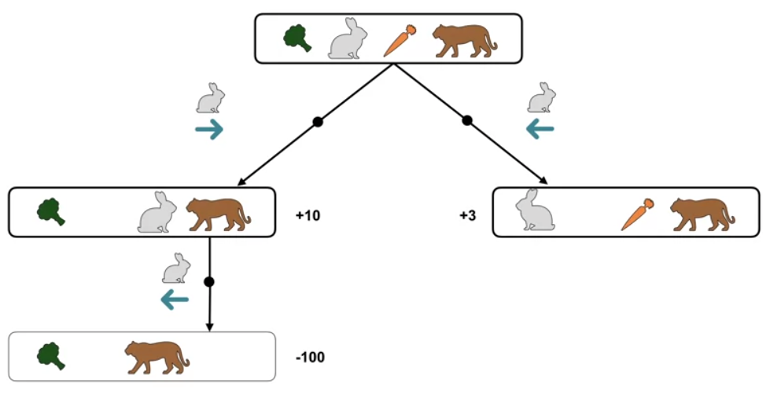

# Markov Decision Processes

## Introduction
In an MDP framework, provides a general framework for sequential decision-making.
The agent interacts with the environment by observing the current state, taking an action based on that state, and receiving a reward in response to its action.

- On the left, the rabbit chose the carrot(+10) but gets eaten by the tiger(-100)
- On the right, the rabbit chose the brocolli(+3)
- The result of right ultimately gives the higher score

## Summary of Agent and Environment interaction in a MDP framework
__State__: The current situation or condition of the environment, providing essential information for decision-making.  
__Action__: The choice made by the agent in response to the current state, determining its course of action.  
__Reward__: The numerical feedback given to the agent by the environment, indicating the quality of its action in a specific state.  

## How dynamics of an MDP are defined by a probability distribution

Defined by a probability distribution denoted as "p."it describes the likelihood of transitioning from the current state to any of the possible next states and receiving corresponding rewards when the agent takes an action.
p have to be
- non-negative
- and the sum of probabilities over all possible next states and rewards equals one

$$ P(s', r | s, a) $$

Given a state s and action a, p tells us the joint probability of next state s prime and reward r. 

__Markov property__
In MDPs, the future state and reward are solely dependent on the current state and action, reflecting the Markov property of the process.

## Formalizing decision-making problems as MDPs

__Robot Navigation__
Consider a mobile robot trying to navigate through an environment with obstacles. The states could represent the robot's location on a grid, actions could be movements (e.g., move forward, turn left), and rewards could be positive when reaching a goal and negative for collisions. The robot's task is to find an optimal policy for reaching the goal while avoiding obstacles.

## Flexibility of the MDP formalism

__Healthcare Treatment__: MDPs assist doctors in making personalized treatment decisions for patients to achieve specific medical goals.

__Autonomous Vehicles__: MDPs enable self-driving cars to navigate traffic by choosing actions based on real-time sensor data while prioritizing passenger safety.

__Natural Language Processing__: MDPs in chatbots decide responses based on user input, considering context and goals to provide relevant information.

---

## Goal of Reinforcement Learning

__Maximizing the expecting return__

[1:24] Function to Maximizing total future rewards

__Episodic tasks__
Episodic tasks are a type of agent-environment interaction where the interaction naturally breaks into episodes. 
Each episode begins independently of how the previous one ended, and there is a terminal state at the end of each episode. 
A concrete example is the game of chess, where each game constitutes an episode.

## The Reward Hypothesis
The idea that instead of specifying how to achieve a goal, you encode the goal, and the machine learns to create its own strategy to achieve it.
It's compared to the saying "give a man a taste for fish," emphasizing adaptability and learning.
- "Give a man a fish" represents traditional AI, where behavior is programmed.
- "Teach a man to fish" is supervised learning, where machines learn from training examples.
- "Give a man a taste for fish" is reinforcement learning, focusing on goal encoding and adaptability.

__Methods for Specifying Rewards__
1. Programming: Defining rewards through a program.
2. On-the-fly rewards: Rewards provided by a person, which can change.
3. Rewards by example: Learning to copy rewards from a person.
4. Inverse reinforcement learning: Figuring out rewards from demonstrated behavior.
5. Optimization: Deriving rewards indirectly through an optimization process.

---

## Episodic and Continuing Tasks

| __Episodic__                               | __Continuing__                                          |
| ------------------------------------------ | ------------------------------------------------------- |
| Interaction breaks naturally into episodes | Interaction goes on continually                         |
| Each episode ends in a terminal state      | No terminal state                                       |
| Episodes are independent                   |                                                         |
| e.g.,                                      | e.g.,                                                   |
|                                            | Thermostat never stops interacting with the environment |

__Discounting for continuing tasks__
For continuing tasks, which have no natural endpoint, it's essential to ensure that the total expected return remains finite. A discount factor, γ (gamma), ranging from 0 to 1, is introduced to ensure finite returns. 
- Low γ (close to 0) makes the agent focus on immediate rewards, ideal for myopic decisions.
- High γ (close to 1) emphasizes long-term gains, suited for far-sighted planning.

__Recursive nature of returns__
G_t includes immediate rewards (R_t) and future discounted returns (G_(t+1)), extending to infinite horizons. This recursive structure allows agents to evaluate actions by considering both present and future consequences. 

__Example Episodic Tasks__
1. Chess Game: Play a complete chess match with a clear start and end.
2. Maze Solving: Navigate through mazes, each attempt is an episode.
3. Robot Pick-and-Place: Grasp and place objects, one task per episode.

__Example Continuing Tasks__

1. Stock Market Trading: Continuously manage investments for long-term gains.
2. Battery Management: Optimize robot battery use over time.
3. Thermostat Control: Maintain room temperature indefinitely.