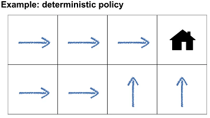
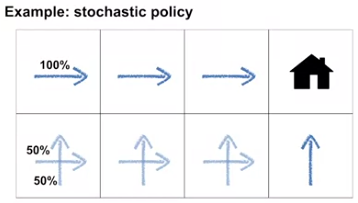
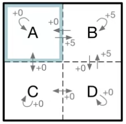
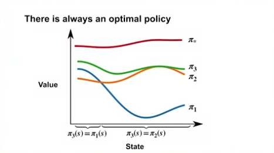
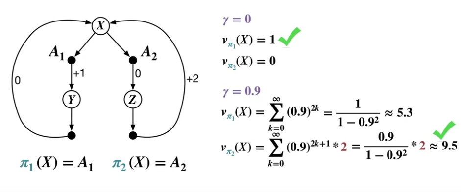

# Value Functions & Bellman Equations

## Policies
A set of rules that an agent uses to chooses actions based on the current state it is in. (How the agent behaves)

__Determistic policy__: maps each state to a single action  
  
__Stochastic policy__: assigns probabilities to each action in each state, used when there is uncertainty or when the agent needs to explore different actions  
  

> NOTE: Both takes the same number of steps to reach the house

__Valid/Invalid policies__  
- __Valid__: should always depend on the current state
  - a state defines all the information for deciding the next action
  - e.g., choose Left or Right with 50% probability L L R L R L R R R ...
- __Invalid__: should not depend on things like time or previous states
  - e.g., alternating Left or Right L R L R L R L R ...

## Value Functions
Helps agents make informed decisions and evaluate different policies. (Given how to agent "behaves", decide on how it makes its next actions)

__State-value function__  
- Denoted as $v_\pi(s)$, where $v$ represents the state-value, $\pi$ indicates the policy, and $s$ represents the state
- The expected return from a given state under a specific policy (sum of future rewards)
- Help agents assess the quality of their current situation and predict future rewards

__Action-value function__  
- Denoted as $q_\pi(s, a)$, where $q$ represents the action-value, $\pi$ indicates the policy, $s$ represents the state, and $a$ represents the action
- The expected return from a given state after selecting a particular action and then following a given policy
- Allow agents to evaluate the quality of different actions in a given state when following a specific policy

> In summary, guide an agent's decisions based on the expected long-term return (policy evaluation) VS choosing the best action in a given situation (action selection)

__Relationship between value functions and policies__  
- Value function helps assess the quality of different policies by estimating the expected return under each policy.

__Examples of valid value functions__  
- __State-value function__: For example, if the agent is near the goal state in a chess grid, the state-value function might assign a high value to that state because it's likely to lead to high rewards if the agent follows the policy Pi to reach the goal.
- __Action-value function__: For example, a robot cleaner estimates the expected return for taking a specific action (e.g., moving toward dirt or away) in a given state (robot's position) and following a policy. Higher Q-values indicate actions that are likely to lead to better long-term outcomes.

---

## Bellman Equations

The Bellman equations establish a connection between current state values and future values to enable the estimation of a state or action's value based on expected future returns, 
without needing to wait for all future rewards. 
Allows agents to make informed decisions by recursively updating values based on future outcomes.

__State-value function__  
The state value function equation relates a state's value to its successors, factoring in policy, transitions, rewards, and discounting.  

$$V_\pi(s) = \sum_{a} \pi(a|s) \sum_{s', r} p(s', r|s, a)[r + \gamma V(s')]$$

- $V_\pi(s)$: This is the value of the current state $s$. It represents the expected cumulative reward starting from state $s$ and following the policy $\pi$.
- $\sum_{a}$: This part of the equation represents the summation over possible actions $a$ taken in state $s$.
- $\pi(a|s)$: This is the policy that selects action $a$ in state $s$.
- $\sum_{s', r}$: This part of the equation represents the summation over possible next states $s'$ and immediate rewards $r$.
- $p(s', r|s, a)$: This term represents the probability distribution of transitioning to the next state $s'$ and receiving an immediate reward $r$ when the agent is in state $s$ and takes action $a$.
- $r$: This is the immediate reward obtained after taking action $a$ in state $s$.
- $\gamma$: The discount factor, which determines the importance of future rewards. It represents how much the agent values immediate rewards compared to future rewards.
- $V(s')$: The value of the next state $s'$. This is the expected cumulative reward starting from the next state $s'$ and following the policy $\pi$.

__Action-value function__  
The action value function equation links the value of a state-action pair to future state-action pairs, considering environment dynamics, rewards, and expected future values under the policy.   

$$q_\pi(s, a) = \sum_{s', r} p(s', r|s, a)[r + \gamma \sum_{a'} \pi(a'|s')q_\pi(s', a')]$$

- $q_\pi(s, a)$: This is the value of taking action $a$ in state $s$. It represents the expected cumulative reward starting from $s$, taking action $a$, and then following the policy $/pi$.
- $\sum_{s', r}$: This part of the equation represents the summation over possible next states $s'$ and immediate rewards $r$.
- $p(s', r|s, a)$: This term represents the probability distribution of transitioning to the next state $s'$ and receiving an immediate reward $r$ when the agent is in state $s$ and takes action $a$.
- $r$: This is the immediate reward obtained after taking action $a$ in state $s$.
- $γ$: The discount factor, which determines the importance of future rewards. It represents how much the agent values immediate rewards compared to future rewards.
- $\sum_{a'}$: This part of the equation sums over all possible actions $a'$ that the agent can take in the next state $s'$.
- $\pi(a'|s')$: This represents the policy's probability of selecting action $a'$ when in state $s'$.
- $Q(s', a')$: The value of taking action $a'$ in the next state $s'$. This is the expected cumulative reward starting from the next state $s'$, taking action $a'$, and then following the policy $\pi$.

__Understanding Bellman Equations__  
  
The state value function is applied to compute the value of each state whereby each state has its own Bellman equation.  
- For each state, it considers the four possible actions (up, down, left, and right) and the corresponding successor states and rewards. 
- By summing these values with their associated probabilities, a simplified expression for the value of a state is derived. 
All 4 Bellman equation here makes up the system of linear equations representing the relationship between the values of these states,
whereby our goal is to find the unique solution for the values of each states.

__Limitations of Bellman Equations__  
- Can only directly solve small MDPs
- e.g., in more complex problems like chess, where there are an immense number of possible states (approximately 10^45), impractical to calculate the Bellman equation for each state

---

## Optimality (Optimal Policies & Value Functions)

### Defining Optimal Policies
  
  

Policy $\pi_1$ is considered at least as good as policy $\pi_2$,
if the value under $\pi_1$ is greater than or equal to the value under $\pi_2$ for every state. 
This relationship is denoted as $\pi_1$ ≥ $\pi_2$.

There is always at least one optimal policy $\pi_*$ in a MDP and it will have the highest possible value in every state.
> The exponential number of possible policies, makes searching for the optimal policy by brute force impractical to manage. 

__How a policy can be at least as good as every other policy in every state__  
How this happens is that when there are policies excelling in different states, combining them strategically yields a new policy that outperforms the originals in every state. 

For example, 
$\pi_1$, have higher return in some states, while another $\pi_2$ excels in other different states. 
We can create a third policy $\pi_3$, that selects actions based on the better-performing policy between $\pi_1$ and $\pi_2$ for each state, ensuring $\pi_3$ is at least as good as both $\pi_1$ and $\pi_2$ in all states. 

__Identify an optimal policy for a given MDP__
  
  

In this MDP we have 2 deterministic policies $\pi_1$ and $\pi_2$ defined by the agent's choice of action in the initial state X, either A1 or A2.

How we select the optimal policy here is by adjusting the discount factor, gamma $\gamma$.  
$\gamma = 0$  
- The agent prioritizes immediate rewards, making $\pi_1$ optimal because it provides an instant reward of +1 in state X. 
- This is suitable for scenarios where future rewards are less important. 
  
$\gamma = 0.9$  
- This is suitable for considering the long-term cumulative rewards, favoring $\pi_2$.  
- The agent receives a delayed but larger reward of +2 in state X, and this choice leads to a substantially higher expected value of state X (around 9.5) when considering the discounted future rewards.  
  
### Defining Optimal Value Functions (Bellman optimality equations)
  
__Optimal state-value function__  
The highest possible value function across all policies.  
$$v_{\pi_*}(s) = \max_{\pi} v_{\pi}(s)$$

__Optimal action-value function__  
The highest possible action-value function across all policies.  
$$q_{\pi_*}(s, a) = \max_{\pi} q_{\pi}(s, a)$$

__How Bellman optimality equation relates to Bellman equations__  
To derive the Bellman optimality equation for $v_{π_*}(s)$, you replace $π$ with $π_*$ in the standard Bellman equation for $v_\pi(s)$.
Resulting in an equation that no longer depends on any specific policy and represents the maximum possible value of state $s$ under any optimal policy.

### Using Optimal Value Functions to Get Optimal Policies

__Connection between optimal value function and optimal policies__  
An optimal value function measure how good each state is, by quantifying how much expected cumulative reward an agent can obtain when starting from that state and following an optimal policy.

__Determining an optimal policy__  
Given the optimal value function $v_*$ and access to the dynamics of the environment (transition probabilities and rewards), we can derive the optimal policy $\pi_∗$ by considering all available actions in each state and selecting the action that maximizes the expected value based on the optimal value function. 

__Optimal state-value function__  
  
$$v_*(s) = \max_a \sum_{s', r} p(s', r|s, a)[r + \gamma v_*(s')]$$  
  
__Optimal policy function__  
  
$$\pi_*(s) = \arg\max_a \sum_{s', r} p(s', r|s, a)[r + \gamma v_*(s')]$$  
  
$\max$ calculates the maximum expected return achievable among all available actions  
$\argmax$ indicates which action to choose to achieve the maximum expected return  

> This helps us to determine an optimal policy by explicitly identifying the action that maximizes the expected return in a given state