# Map to help us decide what algorithm best fits our problem
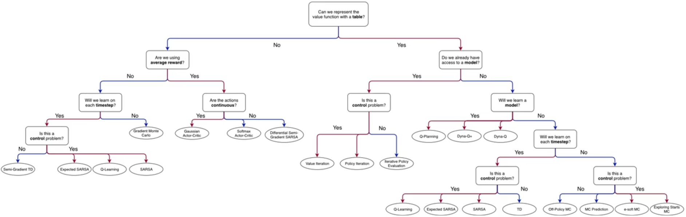
<!--  -->

## What we've learnt so far
<!-- 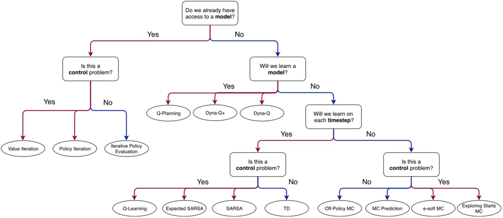 -->

- Dynamic programming methods: compute value functions in iterative policies from the model
  - Value iteration
  - Policy iteration
  - Iterative Policy Evaluation
- Sample-based methods: learn by collecting and analyzing samples of experiences(results of actions)
  - Monte Carlo methods
- Temporal difference learning: allows the agent to make updates to the value function and policy on each step of the episode.
- Model-based planning methods

## What we will learn next
<!-- 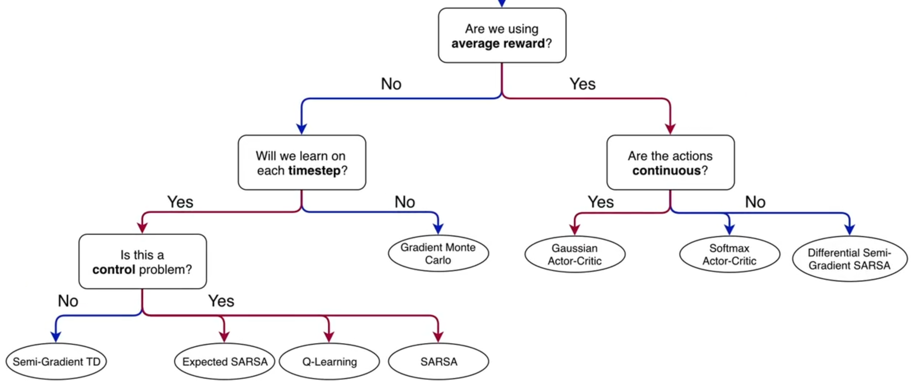 -->

# Lesson 1: Estimating Value Functions as Supervised Learning 

## More general ways to approximate value function

### Parameterized Function

#### Simple Value function approximation  
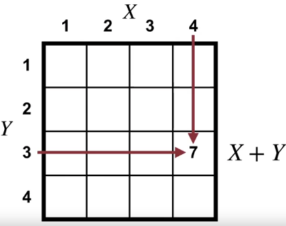  
<!--  -->

- Add X and Y position to produce a value estimate
- No way to do learning with this

#### Parameterizing the Value Function
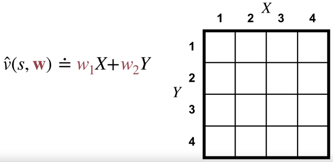  
<!-- 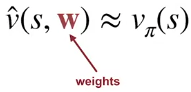 -->
<!--  -->

- Add real valued weights to be adjusted to change the output the function generates

#### Linear value function approximation
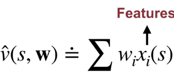

- Weights are multiplied by fixed attributes of the state called features
- Limitations, Relies on having good features  
  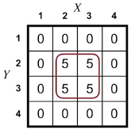
    - using X and Y as features is mentioned as not suitable for certain problems
    - approximation may not be accurate with irrelevant features

#### Tabular value function

- Special case of linear function approximation
- 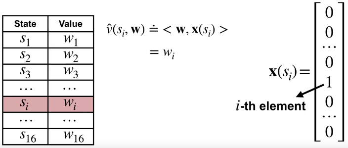  
  
  - Define features: one for each state (all 0 except Si)
  - Compute approximate values for a state with features
  - Every state will have its own weight

---

## Generalization
Applying knowledge about specific situations to draw conclusions about a wider variety of situations

### In Policy evaluation: 
refers to updates to the value estimate of one state influence value of other states
- E.g., a robot collecting rubbish  
  
<!--  -->

  - Generalizing across states where while there are many different sensor reasons, the distance to the rubbish is still the same
  - Speed up learning by making use of experiences (Similar states)

## Discrimination
- Ability to make value of two state different
- E.g., a robot with 2 clearly different state  
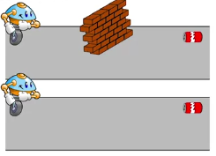

  - we want different value in such states, where there are information/features that impact the value

## Categorizing Methods
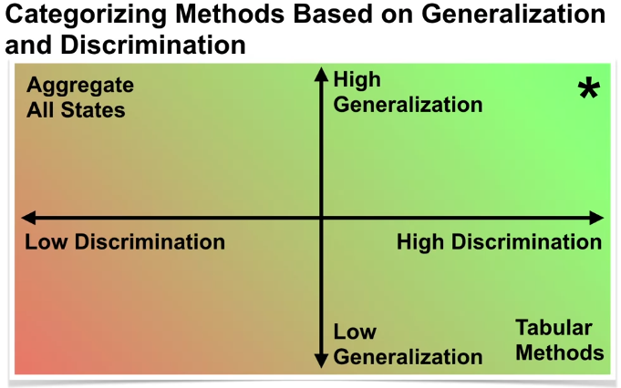  
<!--  -->

- Tabular Methods
  - discriminate between different states, each state's value represented independently.
  - do not generalize the learned values to similar states.
- Treat all states equally
  - all states are treated the same, and each update generalizes to all states.
  - cannot discriminate between states, and at best, it can learn the average return
  - Not useful
- *Balanced Method (good generalization and a good discrimination)
  - Generalize the learned values to similar states, enabling faster learning
  - Discriminate between states, allowing the value function approximation to accurately represent the values with more data.

### Chess example
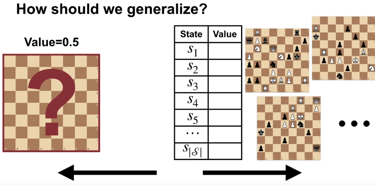 
<!--  -->

- Important to generalize due as impractical to enumerate and learn all the possible states 10^46.

## Framing Value Estimation as Supervised Learning
Borrowing methods from SL, which have functions to approximate values.

- SL typically learn a function from a set of input-target examples.
  - e.g., Monte Carlo method to estimate value function using samples of the return is SL
    - input is the state
    - targets are the returns
- Limitations
  - Some methods are not compatible with the online setting because 
    - RL is typically online where agent interacts continuously (temporally correlated data)
    - SL is typically offline where we have fixed batch of data

---

# Lesson 2: The Objective for On-policy Prediction 

## Mean Squared Value Error
To optimize policy evaluation, we measure how close an approximation is to the true value function.

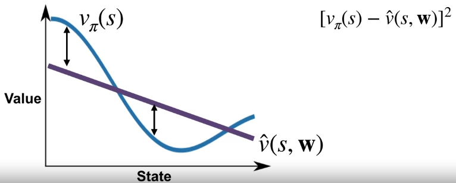 
<!--  -->

- Purple: Value estimate
- Blue: True value
- Measures the error between the value of a state and the approximate value
  - squared difference between the value and the approximation.
- Calculating the squared error for each state is not enough to define an objective for function approximation
  - Improving accuracy in one state might reduce it in another

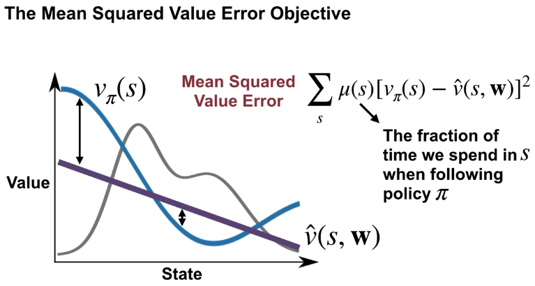 
<!--  -->
 
- Specifying how much we care about getting the value right for each state
  - Mu of S
- To balance between the <-> value of each state

## Gradient Descent
Used to minimize the mean squared value error

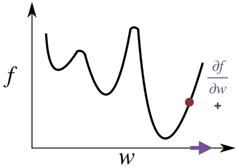 
<!--  -->

- Adjust weights to make value estimates closer to true value function
- We need to understand derivatives (calculus) to determine the direction and magnitude of weight adjustments.
  - i.e., how quickly f changes as we change w
  - which direction to go to reduce objective
- Perform updates repeatedly with small step size to eventually converge to a local minimum point
- Also works with multiple dimension where f is parametized by 1 or more variable
- Effective but may not always guarantee reaching the global minimum
  - i.e., complex function approximations like neural networks.

## Stochastic gradient descent
- Gradient descent: adjust weights based on the gradient of the mean squared value error
- Stochastic gradient descent: efficiently updates weights by sampling states
- SGD typically more efficiency and converges faster than GD.
- Gradient Monte Carlo algorithm
  - extends the use of stochastic gradient descent to estimate the true value.

## State Aggregation

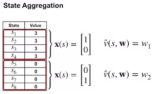

- Treats certains states as the same
  - e.g., aggregate states in groups of four
  - instead of 8 states we now have only 2
  - when 1 state of the group is updated, all other states in same group updated
- Reduces the required dimension of the value function making it more efficient

### Random walk example

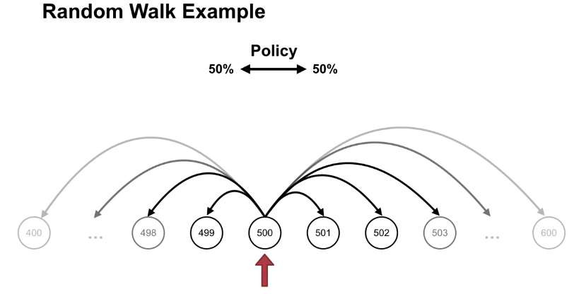 
<!--  -->

- Simple but takes forever to learn entire state space

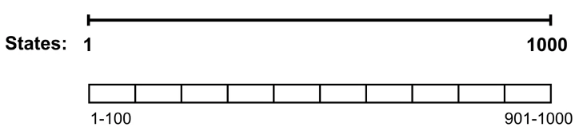 
<!--  -->

- Choose how we aggregate states 
  - Group states that we reasonable believe that they have similar values
  - e.g., states close together
- Gradient Monte Carlo algorithm 
  - updates value estimates for different groups of states.

# Lesson 3: The Objective for TD 
- TD-update for function approximation 
- Semi-gradient TD algorithm for value estimation
- TD vs Gradient Monte Carlo
  - TD better cause converges more quickly

# Lesson 4: Linear TD 
- How to TD update with linear function approximation
  - We do it with linear methods because easy
  - if we have good features, linear methods is better (faster, with decent accuracy)
- Something about TD fixed point being the True objective for TD
  - TD fixed point: tells us that the agent has successfully learned to predict the value of states